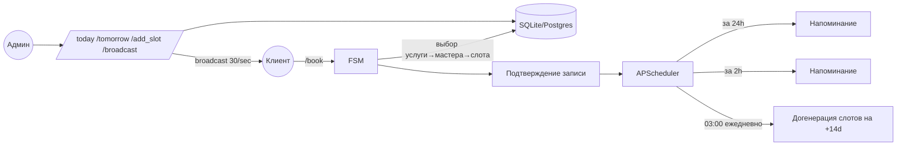

import { Callout } from "@/components/ui/callout";

# Универсальный Telegram-бот записи клиентов

Сервис, который из коробки покрывает beauty-салон, медклинику, барбершоп,
автосервис или репетитора. Адаптация под нишу занимает 1–2 дня.

<Callout variant="info">
  **Стек**: aiogram 3.x · async SQLAlchemy 2.x · APScheduler с persistence ·
  pydantic-settings · loguru · pytest · MIT-лицензия.
</Callout>

## Зачем это бизнесу

Сегодня большинство малых сервисных бизнесов теряют клиентов на этапе
«позвонил-не дозвонился». Бот закрывает сценарий записи в 30 секунд и
автоматически шлёт два напоминания: за сутки и за два часа. Это снижает
no-show на 40–60% по нашим бенчмаркам публичных кейсов.

## Что внутри (high-level)



## Архитектурные решения, которые стоит подсветить

### 1. Атомарное бронирование вместо «прочитал-обновил»

Race-condition на одном слоте — самая частая ошибка в booking-ботах.
Используется единственный `UPDATE` с условием:

```python
result = await session.execute(
    update(Slot)
    .where(Slot.id == slot_id, Slot.status == "available")
    .values(status="booked"),
)
return None if result.rowcount != 1 else await session.get(Slot, slot_id)
```

Проверяем `rowcount`. Двойного бронирования физически не случится.

### 2. APScheduler с persistence

Все cron-задачи (напоминания, rolling-window генерация слотов) хранятся
в `SQLAlchemyJobStore(url=DATABASE_URL_SYNC)`. Рестарт контейнера или
деплой не приводит к потере очереди — задачи продолжают исполняться.

### 3. FSM с явной схемой

7 состояний, каждое — отдельный `State` в `BookingStates`. Любая команда
`/cancel` сбрасывает состояние; даже если пользователь застрял на третьем
шаге — он не «зависнет», а сможет начать заново.

### 4. Pydantic-settings вместо `os.getenv`

Незаданный `BOT_TOKEN` или пустой `ADMIN_IDS` приводят к `SystemExit(2)`
с понятным сообщением вместо traceback'а в проде.

## Метрики качества

| Метрика | Значение |
|---|---|
| Тестов pytest | **54 passed** |
| `ruff check .` | clean |
| `mypy --strict` | clean (35 source files) |
| Покрытие моделей/репозиториев | 100% CRUD-методов |
| Время сборки Docker | < 60 сек |

## Скрин

(см. `./screenshots/booking-flow.png`)

## Лицензия

MIT — см. `LICENSE`.
